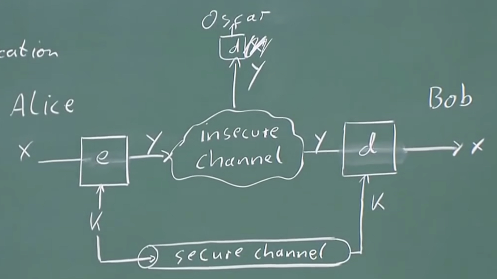

# Topics today  
- classification  
- Basics/Set-up  
- Substitution Cipher  
- Attacks  

## 1. **Classification**
2. Modern application of cryptography?
	- [GNU PG](https://en.wikipedia.org/wiki/GNU_Privacy_Guard) (GNU Privacy Guard)
	- [TrueCrypt](https://en.wikipedia.org/wiki/TrueCrypt)
	- Secure Shell
	- (plug-in)for
	- Thumderbird
	- [S-MIME email encryption](https://docs.microsoft.com/en-us/exchange/security-and-compliance/smime-exo/smime-exo) (Secure/Multipurpose Internet Mail Extensions)
	- cell phone
	- [hdcp-multimedia protection](https://en.wikipedia.org/wiki/High-bandwidth_Digital_Content_Protection) (High-bandwidth Digital Content Protection)
	- bank cards
	- [VPN](https://en.wikipedia.org/wiki/Virtual_private_network) (Virtual private network)
	- e-Passport
	- online banking
	- iPod (itunes - copyright protection)
	- Kindle

### one part of security is cryptography
* very few of security don't have cryptography on board


### Cryptology
* Cryptography
	1. symmetric algorithms
	2. asymmetric algorithms
	3. protocols
* Cryptanalysis

---

## 2. Set-up for symmetric cryptography  
(simple) problem: Communication over insecure channel  
* channel examples:    
	- internet  
	- airwaves GSM, wifi, ...  


  

### In practice: Never use an untested crypto algorithm!  
### Notations
```
x = plaintext  
y = ciphertext  
e = encryption function  
d = decryption function  
k = key  
$|k|$ = K = key space (number of keys)
```

### Kerckhoffs' Principle [1883]  
A cryptosystem should be secure even if the attacker (Oscar) knows all the details about the system, with the exception of the secret key.  
**Remark**: Kerckhoffs' Principle is counterintuitive!  

---

## 3. Substitution Cipher  
Remarks:  
* historical cipher (insecure ciphers, outdated)
* operates on letters
* *Idea*: Replace every plaintext letter by a fixed ciphertext letter.
* Example: 
```
A --> l
B --> d
C --> w
E --> q
  ...
e(ABBA) --> lddl
```
Q: Is the cipher secure?   
A: No.  
Q: How can we attack the cipher?  
A: 
1. Attack: Brute-Force Attack or Exhaustive Key Search  
	* Exhaustive Key Search: 26 * 25 * 24 ... 1 = 26! ≈ 2^88 = 2^56 * 2^32  
	  2^32 ≈ 10^9   --> Key space is too large  
2. Attack: Letter Frequency Analysis (Brute-Force Attack)
	 --> works because identical plaintext map to identical ciphertext symbols
	* Letters have very different frequencies in the English language
	* Moreover: the frequency of plaintext letters is preserved in the ciphertext
	* For instance, "e" is the most common letter in English: almost 13% of all letters in typical ENglish text are "e".
	* The next most common one is "r" with about 9%


