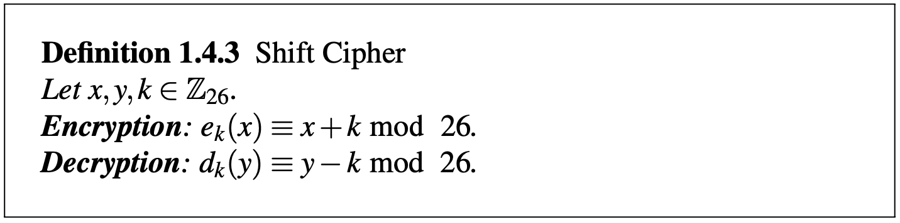
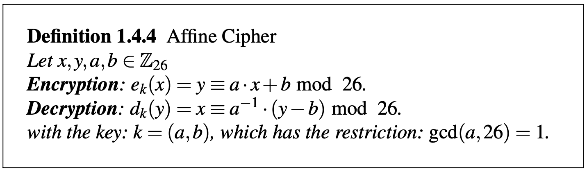

# Lecture 2 - Modular Arithmetic and Historical Ciphers

## Topic today:
* Modular Arithmetic
* Rings
* Shift Cipher
* Affine Cipher

---

## 1. Modular Arithmetic
* Goal: Computation in *finite* sets
* Example: For a finite set in everyday life
	- clock is finite<br>
	```
	   12
	+  20
	-----
	   32

	12+20 ≡ 8 mod 24
	```
### Definition of modular operator<br>
Let a, r, m ∈ ℤ, and m > 0, then we write a ≡ r mod m if m divides (a-r), i.e. m|(a-r) <br>
here m = modulus, r = remainder
	 - Example: 
	 ```
	 a = 13, m = 9, r = ?  
	 13 ≡ 4 mod 9  
	 a-r = (13-4) = 9
	 ```  
### 1a) Computation of the remainder<br>
Given: ```a, m ∈ ℤ```<br>
write ```a = qm```<br>
here q = quotient<br>
- Example:```a = 42, m = 9```<br>
  ```
  42 = 4 ⋅ 9 + 6 => r = 6
  check: (42-6)=36, 9|36 √
  ```
  <br>but also<br>
  ```
  42 = 3 ⋅ 9 + 15 => r = 15
  check: (42-15)=27, 9|27 √
  ```
  <br>but also<br>
  ```
  42 = 5 ⋅ 9 + (-3) => r = -3
  check: (42-(-3))=45, 9|45 √
  ```
<br>==> **The remainder is not unique**
### 1b) Equivalence Classes
- Example: ```a = 12, m = 5```<br>
	```
	12 ≡ 2 mod 5
	check: 5|(12-2) = 5|10
	12 ≡ 7 mod 5
	check: 5|(12-7) = 5|5
	12 ≡ -3 mod 5
	check: 5|(12-(-3)) = 5|15
	```
#### Definition: The set
```{..., -8, -3, 2, 7, 12, 17, ...}``` forms an "equivalence class" modulo 5. All members of the class behave equivalent modulo 5.<br>

- Let's look at all equivalence classes modulo 5<br>
	```{..., -10, -5, 0, 5, 10, ...}```	A<br>
	```{..., -9, -4, 1, 6, 11, ...}```	B<br>
	```{..., -8, -3, 2, 7, 12, ...}```	C<br>
	```{..., -7, -2, 3, 8, 13, ...}```	D<br>
	```{..., -6, -1, 4, 9, 10, ...}```	E<br>
	infinite members in these sets
	```
	13 ⋅ 16 - 8 = 208 - 8 = 200 ≡ 0 mod 5
	 D ⋅ B  - D
	 3 ⋅ 1  - 3 = 3 - 3 ≡ 0 mod 5
	 8 ⋅ 6  - (-7) = 48 + 7 = 55 ≡ 0 mod 5
	```
	**Important application**<br>

- Example:```3^8 mod 7 ≡ ?```
	1. 1st way:<br>
	```3^8 = 6561 ≡ 2 mod 7```
	2. **2nd way**:<br>
	```3^8 = 3^4 ⋅ 3^4 = 81 ⋅ 81 ≡ 4 ⋅ 4 = 16 ≡ 2 (mod 7)```

---

## 2. Rings: An Algebraic View on Modular Arithmetic
### Definition: The "integer ring" ℤm consists of 
1. The set ```ℤm = {0, 1, ..., m-1}```
2. Two operators "+" and "⋅" such that for all ```a, b, c, d ∈ ℤm```
	1. ```a + b ≡ c mod m```
	2. ```a ⋅ b ≡ d mod m```

* Sect. 4.2 All this point, the following properties of rings are important (book pg. 17)
	- Example for multiplication inverses```m = 9, ℤ_9 = {0,1,2,3,4,5,6,7,8}```
		1. multiplication inverses of 2 mod 9
		```
		a = 2
		a^{-1} = 2
		2 ⋅ 2^{-1} ≡ 1 mod 9
		2 ⋅   5    ≡ 1 mod 9
		--> 2^{-1} ≡ 5 mod 9
		gcd(2,9) = 1

		6 ⋅   ?    ≡ 1 mod 9
		gcd(6,9) = 3 ≠ 1
		```
	- ==> If the gcd of the number you want to invert and the modulo is 1, the inverse exists.<br>

---

## 3. Shift (or Caesar) Cipher
* Idea: shift letters in alphabet
* Definition 1.4.3 Shift Cipher<br>
	  
* Example:
	```
	k = 3  
	then       
	A --> d
	B --> e
	  ...
	W --> z
	X --> a
	Y --> b
	Z --> c
	      ↑ wrap around modulo 26
	```
* Example 1.11. 
	```
	Let the key be k = 17, and the plaintext is: 
	ATTACK = x1, x2, ..., x6 = 0, 19, 19, 0, 2, 10  
	The ciphertext is then computed as  
	y1, y2, ..., y6 = 17, 10, 10, 17, 19, 1 = rkkrtb  
	```
* Not secure. 
* Two attacks possible
	1. Frequency analysis
	2. Brute-Force (Full-key search)
* Key space: 26

---

## 4. Affine Cipher
* Definition 1.4.4 Affine Cipher<br>
	  
	- encryption rule: 
		```
		k = (a,b)
		y ≡ a ⋅ x + b mod 26
		```
	- decryption rule:
		```
		y - b ≡ a ⋅ x mod 26 
		a^{-1}(y - b) ≡ x mod 26
		x ≡ a^{-1}(y - b) mod 26
		```


